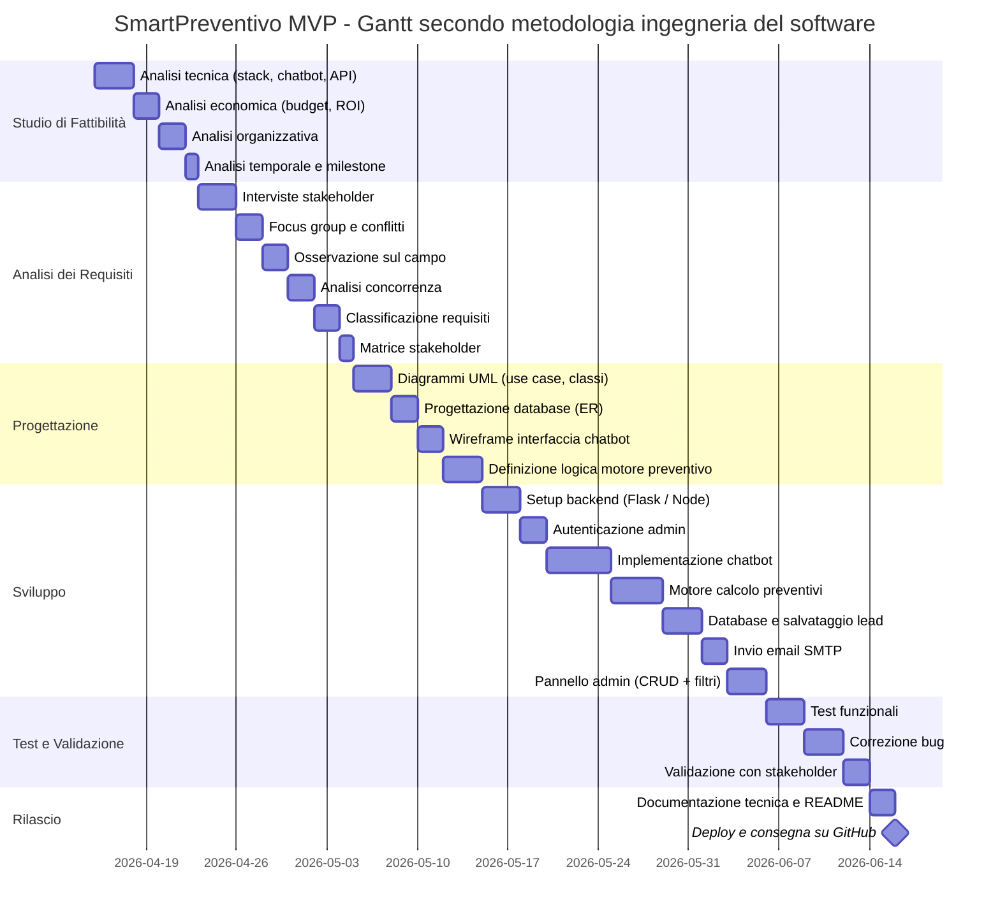

```mermaid
gantt
    title SmartPreventivo MVP - Gantt secondo metodologia ingegneria del software
    dateFormat  YYYY-MM-DD

    section Studio di Fattibilità
    Analisi tecnica (stack, chatbot, API)        :f1, 2026-04-15, 3d
    Analisi economica (budget, ROI)              :f2, after f1, 2d
    Analisi organizzativa                        :f3, after f2, 2d
    Analisi temporale e milestone                :f4, after f3, 1d

    section Analisi dei Requisiti
    Interviste stakeholder                       :a1, after f4, 3d
    Focus group e conflitti                      :a2, after a1, 2d
    Osservazione sul campo                       :a3, after a2, 2d
    Analisi concorrenza                          :a4, after a3, 2d
    Classificazione requisiti                    :a5, after a4, 2d
    Matrice stakeholder                          :a6, after a5, 1d

    section Progettazione
    Diagrammi UML (use case, classi)             :p1, after a6, 3d
    Progettazione database (ER)                  :p2, after p1, 2d
    Wireframe interfaccia chatbot                :p3, after p2, 2d
    Definizione logica motore preventivo         :p4, after p3, 3d

    section Sviluppo
    Setup backend (Flask / Node)                 :s1, after p4, 3d
    Autenticazione admin                         :s2, after s1, 2d
    Implementazione chatbot                      :s3, after s2, 5d
    Motore calcolo preventivi                    :s4, after s3, 4d
    Database e salvataggio lead                  :s5, after s4, 3d
    Invio email SMTP                             :s6, after s5, 2d
    Pannello admin (CRUD + filtri)               :s7, after s6, 3d

    section Test e Validazione
    Test funzionali                              :t1, after s7, 3d
    Correzione bug                               :t2, after t1, 3d
    Validazione con stakeholder                  :t3, after t2, 2d

    section Rilascio
    Documentazione tecnica e README              :r1, after t3, 2d
    Deploy e consegna su GitHub                  :milestone, after r1, 0d
```
