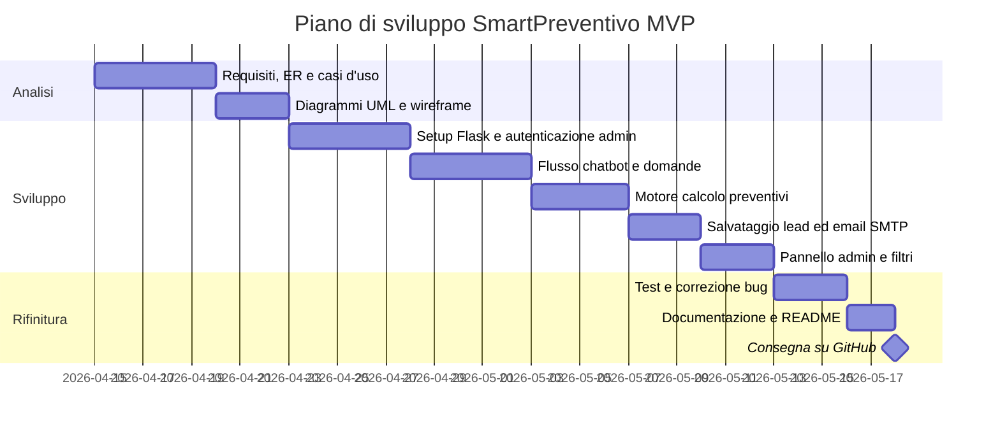

```mermaid
gantt
    dateFormat  YYYY-MM-DD
    title Piano di sviluppo SmartPreventivo MVP
    section Analisi
    Requisiti, ER e casi d'uso         :a1, 2026-04-15, 5d
    Diagrammi UML e wireframe           :a2, after a1, 3d
    section Sviluppo
    Setup Flask e autenticazione admin  :b1, after a2, 5d
    Flusso chatbot e domande            :b2, after b1, 5d
    Motore calcolo preventivi           :b3, after b2, 4d
    Salvataggio lead ed email SMTP      :b4, after b3, 3d
    Pannello admin e filtri             :b5, after b4, 3d
    section Rifinitura
    Test e correzione bug               :c1, after b5, 3d
    Documentazione e README             :c2, after c1, 2d
    Consegna su GitHub                  :milestone, after c2, 0d
```
